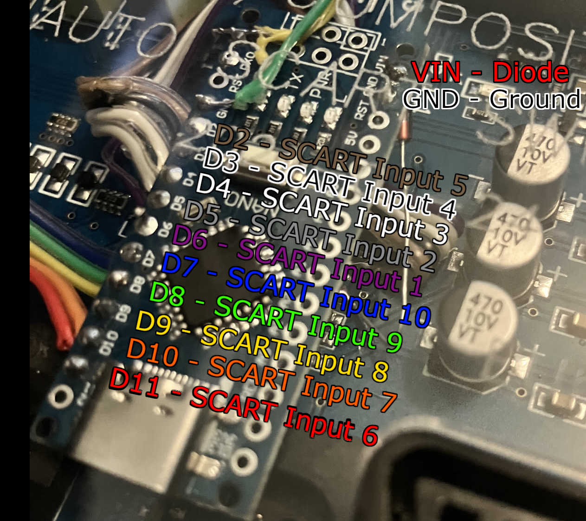
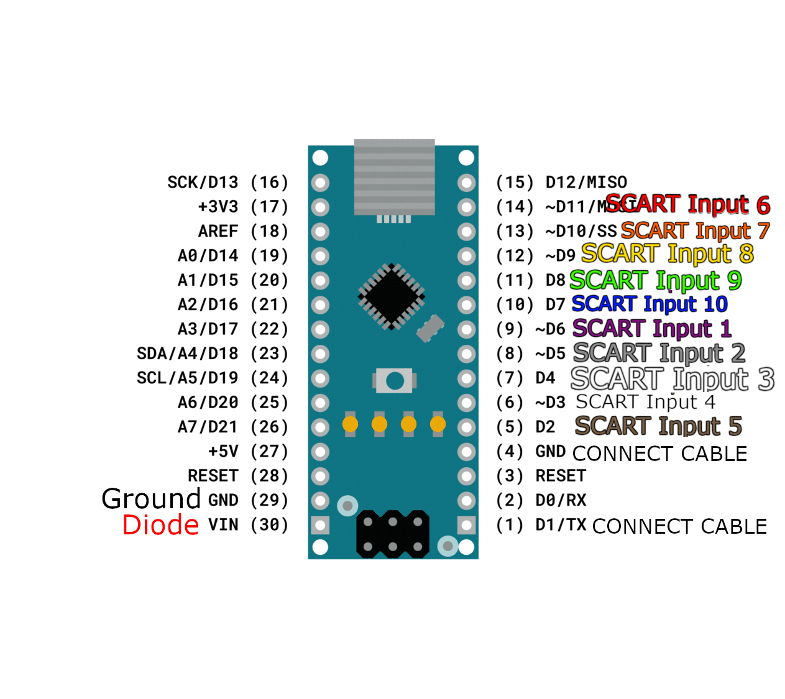
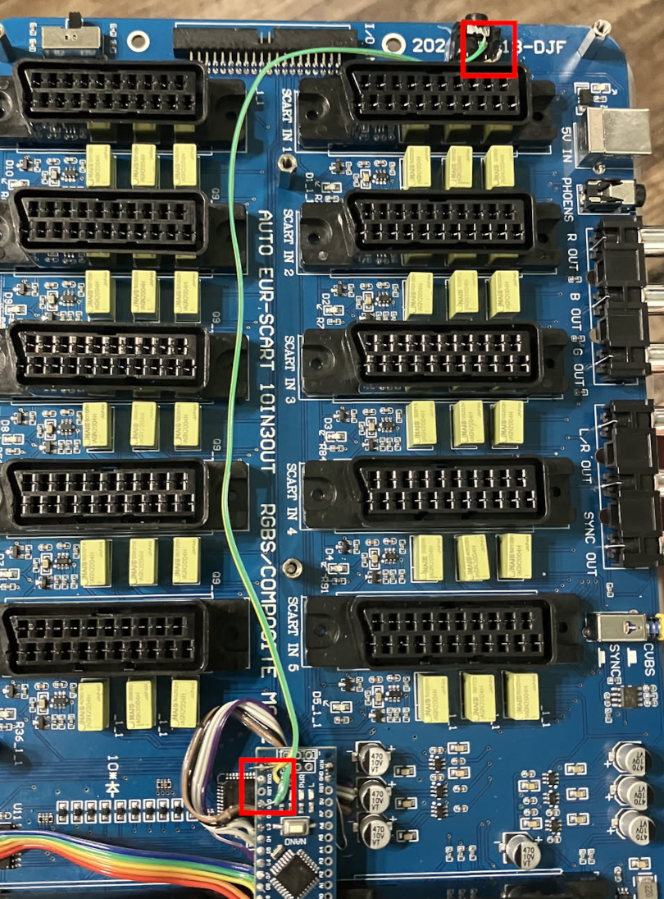

# Please Notice:
  - It is recommended to place a 10k resistor between the Arduino's Tx and RT4K's Rx. In the guide, this could easily be done between the Arduino's Tx and 3.5mm jack. This is the prevent the RT4K from being backpowered by the Arduino when it's power is off.
  - No need for wiring "Rx" in the picture guides below as it has no current purpose. You can leave it disconnected.

## Otaku Games Scart Switch

RetroTink 4K HD15 Serial Control using an Arduino Nano, Integrated with a 10 Port Otaku Games Scart Switch. The code is very basic at the moment, but allows executing multiple commands to the RT4K (even with delays inbetween) if needed. Please feel free to fork / create PRs / etc. 

See it in action: https://youtu.be/L7HAki0e440

This implementation taps into 2x ULN2003 Darlington Arrays that are used to activate a led and relays for the LAST ACTIVE scart port. Each individual led/relay line is connected to an input pin on the Arduino. If an input pin on the Arduino detects a voltage drop, then a command is sent to the RetroTink telling it to change to that pin's / scart ports assigned remote profile. This does not touch the Scart signal or MCU and should not affect image quality. This is all based on my general observation of the PCB, I don't have any official documentation to go by. 

## Nano [5v tolerant] (Recommended)

## 2023-03-13 DJF (BLUE) BOARD + Arduino Nano
Step 1: We need to first determine which input corresponds to which pin in the Darlington array. To do this, we can just listen in with a multimeter by setting the red probe on a leg and cycling through inputs. After probing, I found the following legs corresponded to the following inputs:

Step 2: This has already been pictured above, but the next step is to solder leads to the pins. Please pardon the messy soldering... dealing with stranded wire is always a bit tough for me.
Once again, please check your own pinout before soldering. It's a lot easier to check with a multimeter than removing ribbon wires.

Step 3: Solder to GND and 5V. We will need to power our Arduino Nano somehow, and that somehow is by tapping into the capacitor just below the Darlington Array for SCART inputs 1-5. Before soldering, please verify which is GND and which is 5V by using a multimeter.

While the picture has a red cable coming from the 5V point, I ended up replacing this cable for the BAT85 diode as to prevent backfeeding the switch when plugging in a USB-C cable from a PC to the Nano to program it. This might not be fully necessary, but I personally prefer to be a bit safer here. Be sure to orient the diode correctly, with the black ring side (cathode) closer to the Nano and the anode being soldered to the switch's capacitor. Additionally, ensure that the legs of the diode do not touch any other components.

Step 4: Wire it all up to the Arduino Nano. The hard part of soldering to the board is over. Good work!
This is the pinout I followed when soldering the leads from the Darlington Arrays to the Arduino Nano:

While you are at it, connect cables to the holes labelled TX1 and GND.

Step 5: With a multimeter, verify the pinout for your PJ-307 headphone jack. You will want to wire the tip of a 3.5mm cable to TX, and the sleeve (not the middle part) to GND.

Step 6: Connect the cables from TX1 and GND to your headphone jack. Remember that you want your TX point to connect to the tip. With a TRS cable, this means your "R" will be floating. Typically, this would be where Rx is soldered to, but there's no point in this application. You may now set your iron down, as this is all the soldering we have to do.

Step 7: Use your hot glue gun to mount the headphone jack wherever is most convenient for you. I mounted it towards the back, but your situation may differ from mine. Be sure to let the hot glue cool appropriately and try not to put any unnecessary stress on the joint. If it comes off in the future, just hot glue it again.
