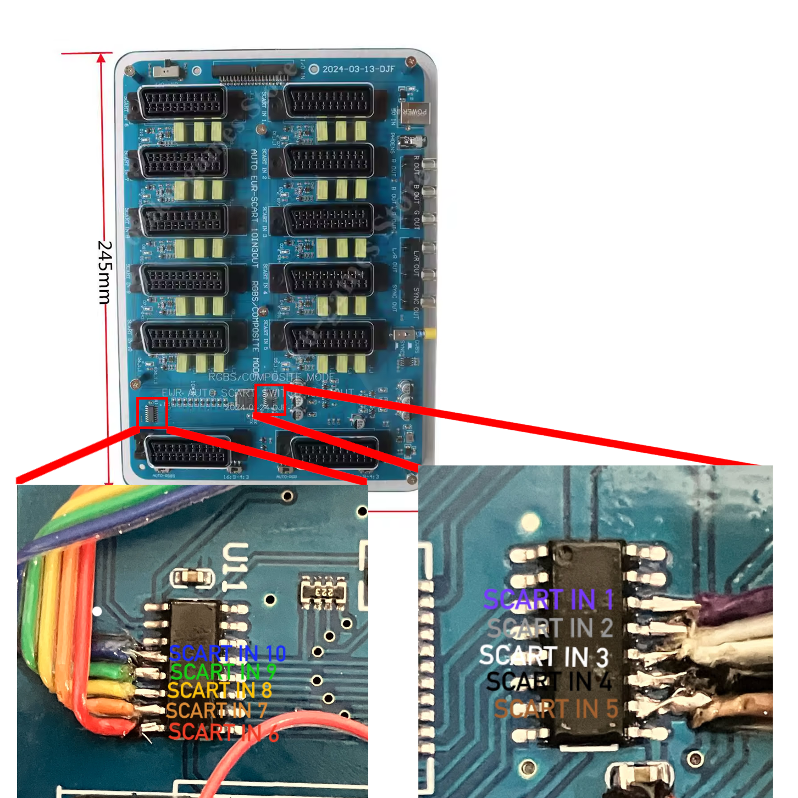
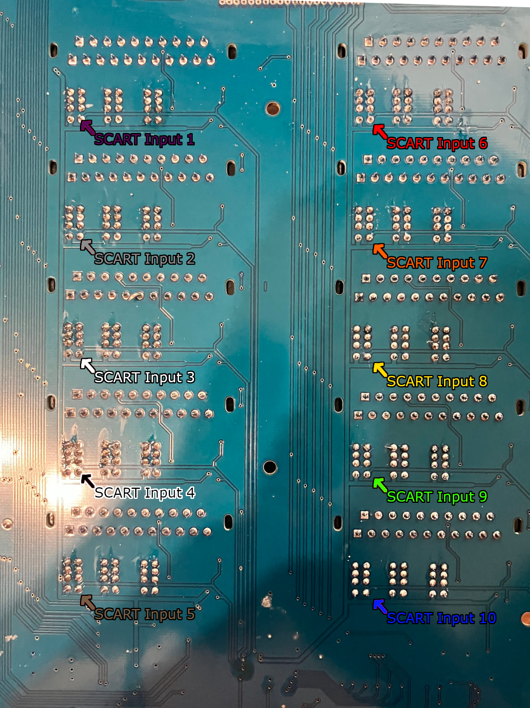
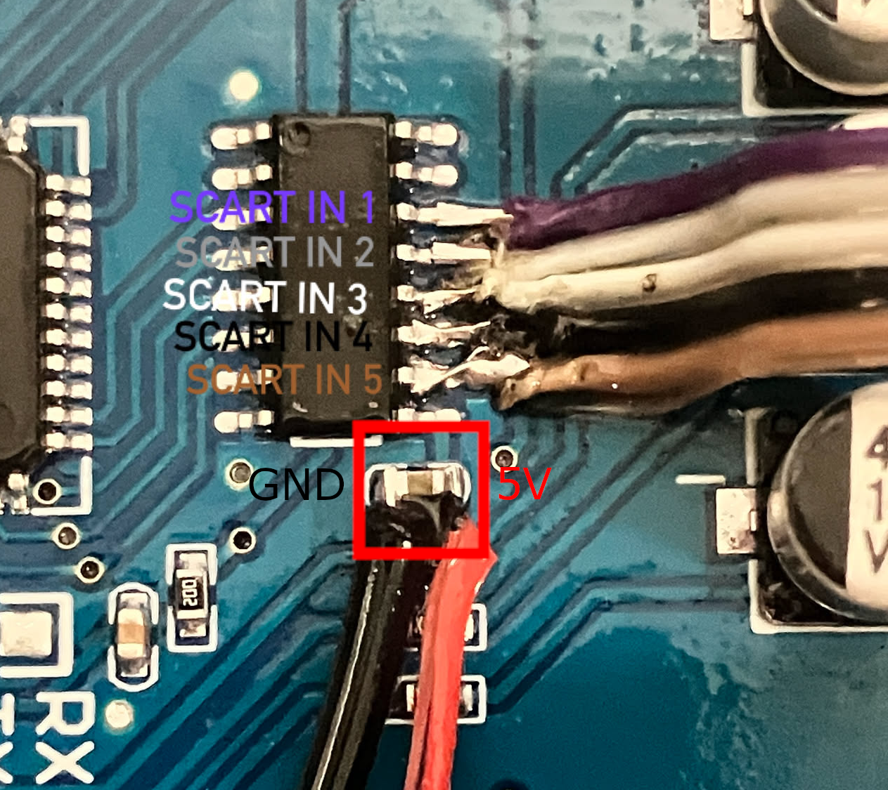
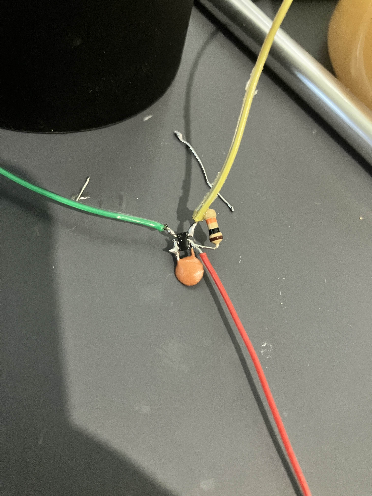
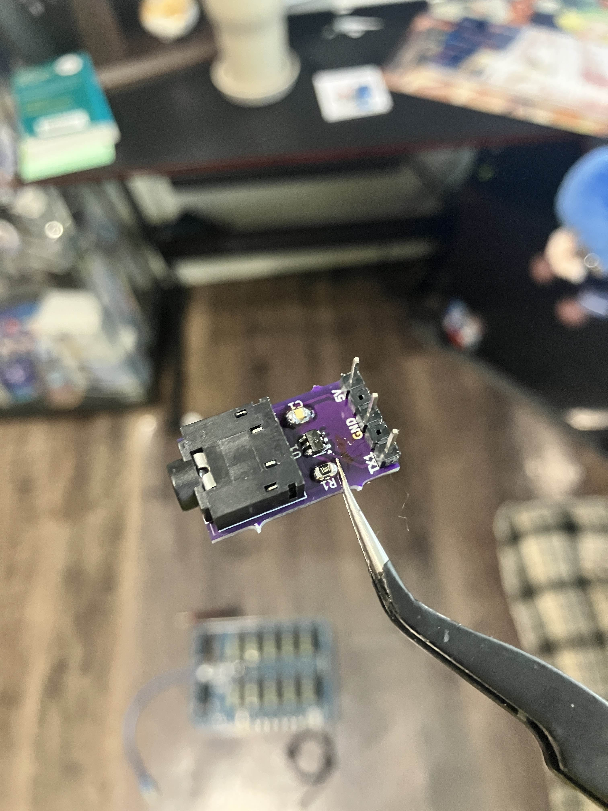
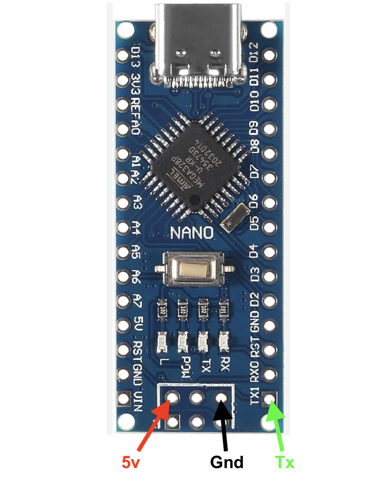
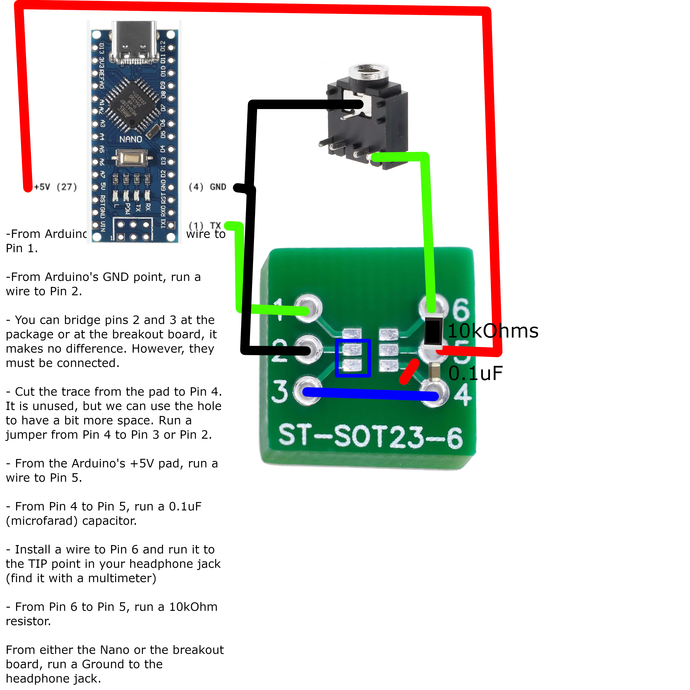
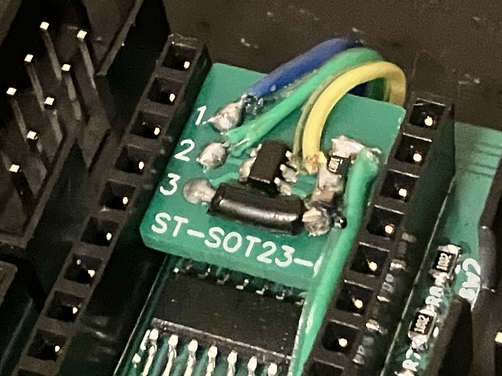

# Please Notice:
  - It is recommended to place a 10k resistor between the Arduino's Tx and RT4K's Rx if not adding a buffer for open-drain. In the guide, this could easily be done between the Arduino's Tx and 3.5mm jack. This is the prevent the RT4K from being backpowered by the Arduino when its power is off.
  - No need for wiring "Rx" in the picture guides below as it has no current purpose. You can leave it disconnected.
  - If you choose to forego the open-drain buffer and use just the Nano's Tx, it must be the only serial device connected to the RT4K's HD-15 serial port. You cannot use multiple push-pull serial devices at the same time via a headphone splitter like you can with open-drain. In short: you cannot mix and match push-pull and open-drain.

## Otaku Games Scart Switch

RetroTink 4K HD15 Serial Control using an Arduino Nano, Integrated with a 10 Port Otaku Games Scart Switch. The code is very basic at the moment, but allows executing multiple commands to the RT4K (even with delays inbetween) if needed. Please feel free to fork / create PRs / etc. 

See it in action: https://youtu.be/L7HAki0e440

This implementation taps into 2x ULN2003 Darlington Arrays that are used to activate a led and relays for the LAST ACTIVE scart port. Each individual led/relay line is connected to an input pin on the Arduino. If an input pin on the Arduino detects a voltage drop, then a command is sent to the RetroTink telling it to change to that pin's / scart ports assigned remote profile. This does not touch the Scart signal or MCU and should not affect image quality. This is all based on my general observation of the PCB, I don't have any official documentation to go by. 

## 2024-04-11 DJF (GREEN) BOARD + Arduino Nano

## 2024-03-13 DJF (BLUE) BOARD + Arduino Nano

While I can't personally confirm it, the pinout should also match the 2025-03-17-DJF board.

Step 1: We need to first determine which input corresponds to which pin in the Darlington array. To do this, we can just listen in with a multimeter by setting the one probe on a leg and cycling through inputs, as well as a second probe on any ground point. You may find that you have a negative voltage reading in your multimeter, but that's okay. It just means your probes are backwards. After probing, I found the following legs corresponded to the following inputs:

There are also alternate points in the backside of the board that are easier to solder to, in case you're not confident in soldering to the Darlington arrays. Please note that these have only been identified via a multimeter continuity check and whether they work or not has not been thoroughly tested. Additionally, make sure you're checking these points with a multimeter as you did in Step 1 before soldering as your board revision may be different.

Step 2: This has already been pictured above, but the next step is to solder leads to the pins. Please pardon the messy soldering... dealing with stranded wire is always a bit tough for me.
Once again, please check your own pinout before soldering. It's a lot easier to check with a multimeter than removing ribbon wires.

Step 3: Solder to GND and 5V. We will need to power our Arduino Nano somehow, and that somehow is by tapping into the capacitor just below the Darlington Array for SCART inputs 1-5. Before soldering, please verify which is GND and which is 5V by using a multimeter in continuity mode.

While the picture has a red cable coming from the 5V point, I ended up replacing this cable for a BAT85 Schottky diode as to prevent backfeeding the switch when plugging in a USB-C cable from a PC to the Nano to program it. This might not be fully necessary, but I personally prefer to be a bit safer here. Be sure to orient the diode correctly, with the black ring side (cathode) closer to the Nano and the anode being soldered to the switch's capacitor. Additionally, ensure that the legs of the diode do not touch any other components.

Step 4: Wire it all up to the Arduino Nano. The hard part of soldering to the board is over. Good work!
This is the pinout I followed when soldering the leads from the Darlington Arrays to the Arduino Nano:

Step 5: With a multimeter and a 3.5mm cable, verify the pinout for your PJ-307 headphone jack. You want the tip of your cable to be your TX point, and the sleeve (the one at the bottom) being your GND point. Make note of which is which.

Step 6: If you wish to use a Push/Pull serial connection for your output (the recommended option is open drain, please scroll down a bit to see that), wire the tip of a 3.5mm cable to the TX1 pad of your Nano, and the sleeve (not the middle part) to GND.

Step 7: Connect the cables from TX1 and GND to your headphone jack. Remember that you want your TX point to connect to the tip. With a TRS cable, this means your "R" will be floating. Typically, this would be where Rx is soldered to, but there's no point in this application. Please note that even if you use push-pull, connecting to the Donut Dongle from the SCART switch will still work. If you plan on not using a Donut Dongle and going straight to a VGA adapter on the RetroTINK, please place an in-line 10K Ohm resistor between the TX1 point in the Arduino and the TIP of your headphone jack. Please note that if you plan on routing multiple devices to the VGA adapter, you cannot mix and match between open-drain and push-pull. You may now set your iron down, as this is all the soldering we have to do.

Step 8: Use your hot glue gun to mount the headphone jack wherever is most convenient for you. I mounted it towards the back, but your situation may differ from mine. Be sure to let the hot glue cool appropriately and try not to put any unnecessary stress on the joint. If it comes off in the future, just hot glue it again.

## From Push-Pull to Open Drain

By following the instructions above alone and connecting the Nano to the Donut Dongle, you might find yourself backfeeding the Arduino Nano when it is not connected to power but connected to a powered Donut Dongle, and backfeeding the Donut Dongle when powering the Nano in the Otaku Switch and not the Donut Dongle.

In short, this is due to a difference in the way Serial Communications operate between the OtakuGames Switch's Nano, and the Donut Dongle's Nano. By default, communications in the Arduino Nano use a Push-Pull configuration. The Donut Dongle uses a buffer to "convert" Push-Pull to Open Drain, which is how the RetroTINK 4K prefers serial communication. This was implemented because the original Donut Dongle, without this buffer, backfed power into the RetroTINK 4K through its HD-15 port. This isn't something you really want to do to your 700+ dollar scaler, so the Donut Dongle is made to output as Open Drain. This doesn't mean you can't feed it Push-Pull, but it wouldn't be the best thing for it due to the aforementioned backfeeding.

The true solution is to convert the Nano in the OtakuGames SCART Switch to Open Drain. Thankfully, this is a very simple circuit:

By converting your OtakuGames Nano to Open Drain, you will be able to:

* Prevent potential backfeed damage to your Donut Dongle and your OtakuGames SCART Switch
* Plug in your OtakuGames SCART Switch directly to your VGA Passthrough Adapter or S-Video Adapter on your RetroTINK, and communicate with it without the need of a Donut Dongle
* Stop the annoying LED from being turned on when your OtakuGames SCART Switch is unplugged

## Needed Materials:

| **Qty**    | Designation | Part |  Link  |  Notes |
| ------------- | ------------- |------------- |------------- |------------- |
| 1  | C1 | 0.1 uF / 100nF 50V X7R 0805 Capacitor| [Digikey](https://www.digikey.com/en/products/detail/yageo/CC0805KRX7R9BB104/302874?s=N4IgTCBcDaIMwEYEFokBYAMrkDkAiIAugL5A) | |
| 1  | R1 | 10K OHM 1% 1/8W 0805 Resistor | [Digikey](https://www.digikey.com/en/products/detail/yageo/AC0805FR-0710KL/2827834) | |
| 1  | U1 | IC BUF NON-INVERT 5.5V SOT23-6 | [Digikey](https://www.digikey.com/en/products/detail/texas-instruments/SN74LVC2G07DBVR/486427) or [alternate](https://www.digikey.com/en/products/detail/umw/SN74LVC2G07DBVR/24889644)| |
| 1  | PH1 | PJ-307 3.5mm Stereo Jack | [AliExpress](https://www.aliexpress.us/item/3256805624175150.html) | In theory, you already have this one. |

## Procedure
While it is technically possible to solder everything to the SOT-23-6 package... I wouldn't recommend it.

My recommendation is one of two options:

## Option 1 for Open Drain - Custom PCB

The Gerber Files (.zip) for a custom PCB are included in this project. It mounts directly to your Arduino Nano's through-holes for a very simple installation with no messy wires. You can upload the .zip to your favorite PCB manufacturer such as JLC (not sponsored) or PCBway (not sponsored) and assemble it yourself.

Since your 3.5mm cable will be plugged into the Nano under the clear plastic, it is very recommended to route it and use some of the SCART ports and screw posts as stress relief.

You can see an installation video by clicking the image below:

## Option 2 for Open Drain - Breakout Board

An Amazon seller has a very convenient breakout board for SOT-23-6 packages: 

[Link (non-Affiliate)](https://www.amazon.com/dp/B09J2VG3BH?ref=ppx_yo2ov_dt_b_fed_asin_title&th=1)

A wiring diagram and install instructions would look as follows:

* From Arduino's TX1 point, run a wire to Pin 1.
* From Arduino's GND point, run a wire to Pin 2.
* You can bridge pins 2 and 3 at the package or at the breakout board, it makes no difference. However, they must be connected.
* Cut the trace from the pad to Pin 4. It is unused, but we can use the hole to have a bit more space. Run a jumper from Pin 4 to Pin 3 or Pin 2.
* From the Arduino's +5V point, run a wire to Pin 5.
* From Pin 4 to Pin 5, run a 0.1uF (microfarad) capacitor.
* Install a wire to Pin 6 and run it to the TIP (as in, Tip/Ring/Sleeve) point in your headphone jack (find it with a multimeter).
* From Pin 6 to Pin 5, run a 10kOhm resistor.
* From either the Nano or the breakout board, run a Ground wire to the headphone jack.

Please note that pictured is the full circuit. However, this particular picture is not from an Otaku SCART Switch, so placement will vary here. Your installation will not win prettiest girl at prom, but your output will be Open Drain, so you will gain all the benefits mentioned above.
